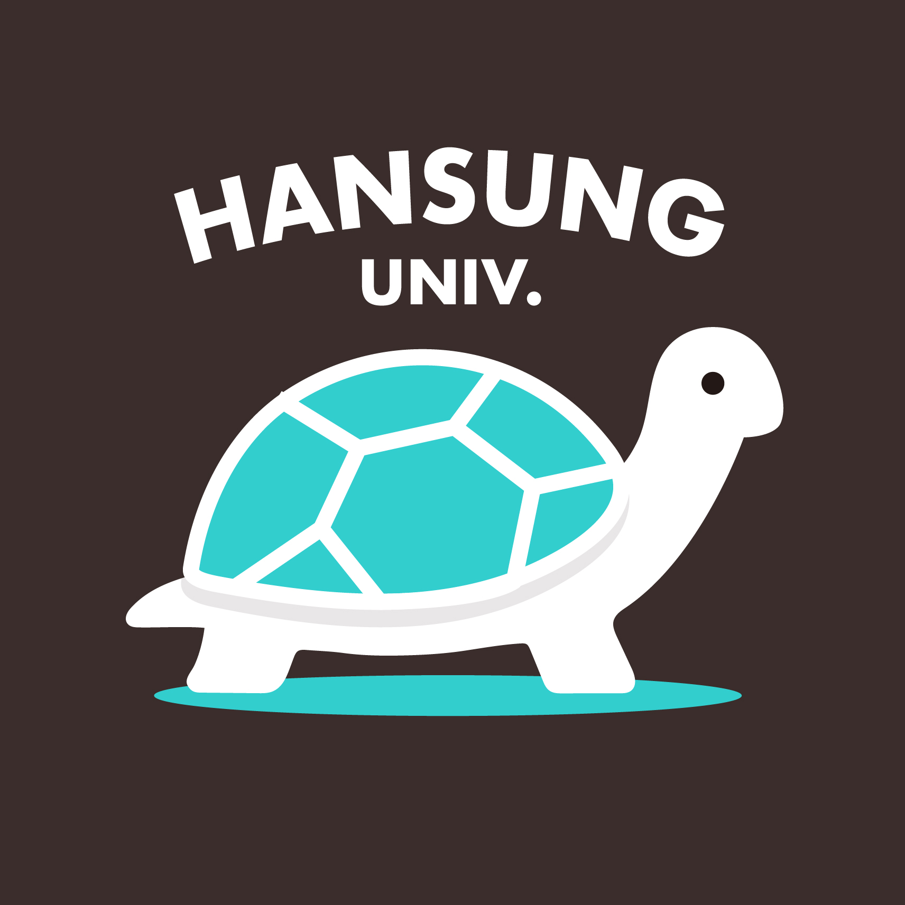
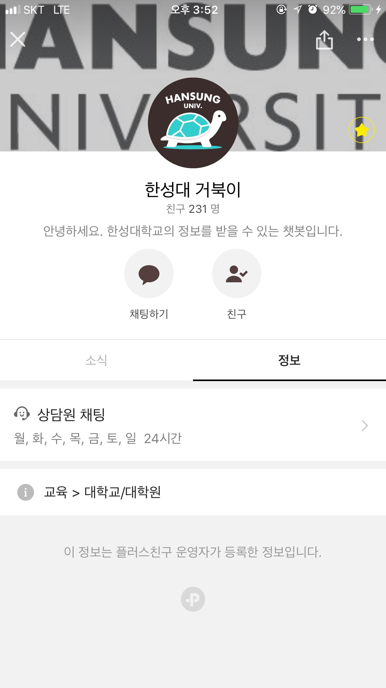
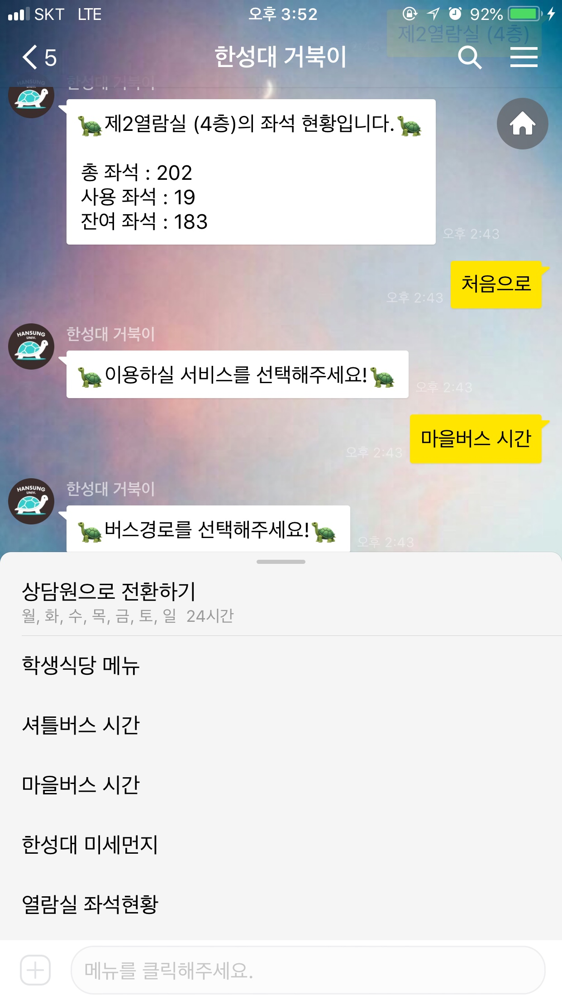
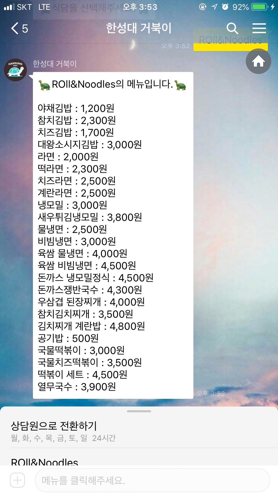
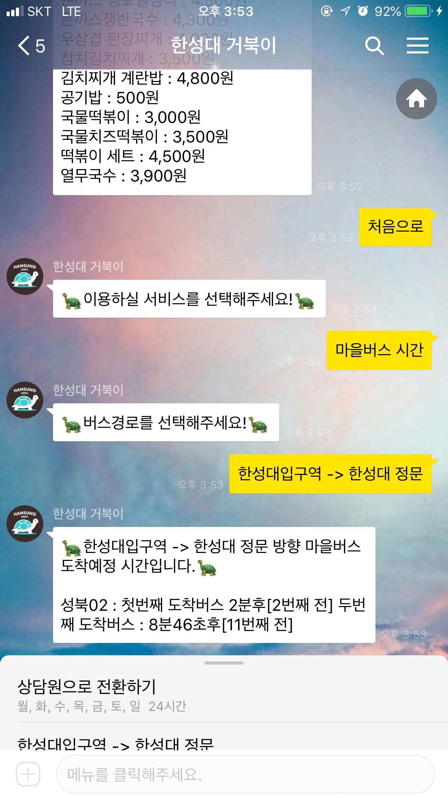
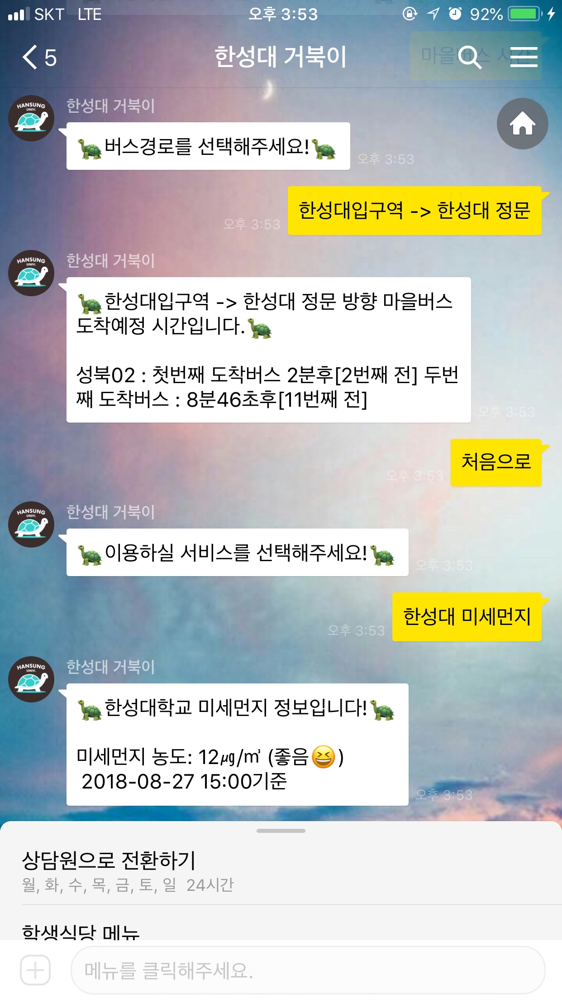
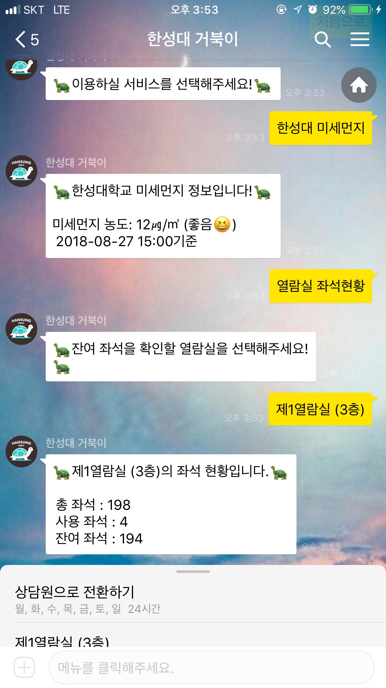

# [한성대 거북이](http://pf.kakao.com/_DwzLC)

* 한성대학교 학생들을 위한 챗봇 한성대 거북이 서버 개발 레파지토리

---

# 개요
* 다른 개발자분의 추천으로 실제로 서비스까지 기획을 하는 프로젝트를 하게되었습니다. 그동안의 진행했었던 프로젝트는 실제 서비스까지 가지못했습니다.. 하지만 카카오플러스친구라는 플랫폼을 활용하여 좀 더 서비스를 쉽게 진행할 수 있는 방안을 찾아 실제로 서비스를 하게되었습니다.

* 많은 사람들이 이용하고 있는 서비스인 카카오톡을 이용한다면 기존에 사용하던 앱을 통해 정보를 간편하게 얻을 수 있을 것이라고 생각했습니다. 이 점이 프로젝트를 서비스하는데 큰 장점이 될 것으로 생각하여 이를 토대로 한성대학교 한성대 거북이를 기획하게 되었습니다.

---

# '한성대 거북이' 기능

* 학생식당 메뉴

* 셔틀버스 운행시간

* 마을버스 도착예정시간(성북02, 종로03)

* 한성대 미세먼지

* 열람실 좌석 현황

* 한성대 오늘날씨

---
# 스크린샷

---

# 개발 환경

* Nodejs

* AWS ec2

* AWS rds

* mysql

---
# 기본 환경에 대한 설명

* 환경설정

* node_moudels

* PM2 configuration

* src - (controller, dao, lib, routes, service)

* app.js

---

# 실행절차

1. npm install -g yarn
2. yarn install

---
# 환경 실행 방법

1. 로컬에서 개발을 진행할 경우 yarn start:dev
2. 로컬에서 개발을 위한 pm2 실행시 yarn start:pm2

---
# 사용 모듈

* [lodash](https://www.npmjs.com/package/lodash)

* [Async & Await](https://www.npmjs.com/package/async)

* [request](https://www.npmjs.com/package/request)

* [cheerio](https://www.npmjs.com/package/cheerio)

* [promise-mysql](https://www.npmjs.com/package/promise-mysql)
